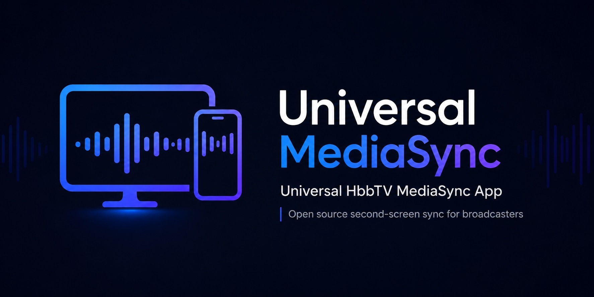

# Universal HbbTV MediaSync App

## Vision

Create a **universal HbbTV MediaSync application**, open source and maintained by the community of HbbTV members, enabling complementary content to be played on a second device such as a mobile phone or tablet, **perfectly synchronized** with the main TV content.

The goal is to provide **a single application for all broadcasters** that want to enable second-screen experiences, avoiding the need for each broadcaster to develop and maintain its own dedicated app.

## Value Proposition

- **Minimal adoption effort for broadcasters.** Joining the initiative is as simple as adding a small code snippet that enables MediaSync for the selected content and specifies which complementary content should be offered on the second screen.
- **Frictionless user experience.** Activation for the viewer should be as direct and seamless as possible.

## How It Works

1. The mobile app **discovers devices on the Wi-Fi network** that have MediaSync enabled, using the **DIAL** protocol (SSDP).
2. The user selects the TV set.
3. The app connects to the running HbbTV application, receives the content ID over **CSS-CII** (`ms.contentIdOverride`), and reads the DASH **MPD**.
4. It presents the user with the **available audio and video tracks** announced in the manifest.
5. The selected track plays **with precise synchronization** via **DVB-CSS** (CSS-WC UDP wallclock + CSS-TS timeline, `urn:dvb:css:timeline:pts`, 90 kHz).

Additional capabilities:
- **Background audio**: minimize the app and keep the synchronized audio playing.
- **Video track** selection (e.g. sign-language / alternate video) with a visible player.
- 7 UI languages: Catalan, Spanish, Basque, English, German, Italian, French
  (default/fallback: **English**).

## License

Released under the [MIT License](LICENSE). Maintenance is open and community-driven —
any HbbTV member is welcome to propose and contribute new features.
