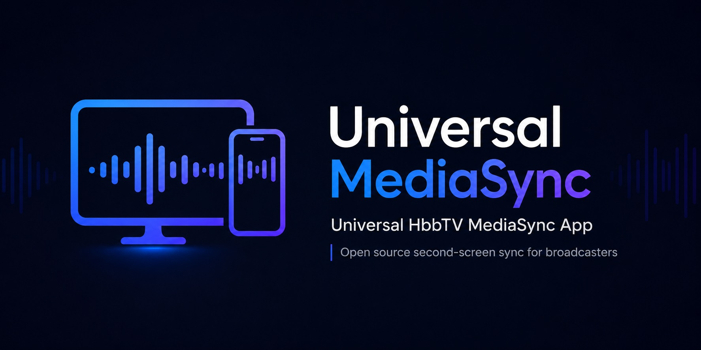

# Universal HbbTV MediaSync App

[](https://github.com/CCMA-Enginyeria/Universal-HbbTV-MediaSync-App/actions/workflows/native-core.yml)
[](https://github.com/CCMA-Enginyeria/Universal-HbbTV-MediaSync-App/actions/workflows/build-android.yml)
[](LICENSE)
[](#)
[](https://play.google.com/store/apps/details?id=cat.ccma.lab.universalmediasync&pcampaignid=web_share)
[](native/android)
[](native/ios)



## Download

The Android app is available on Google Play: [Universal MediaSync](https://play.google.com/store/apps/details?id=cat.ccma.lab.universalmediasync&pcampaignid=web_share).

## Vision

Create a **universal HbbTV MediaSync application**, open source and maintained by the community of HbbTV members, enabling complementary content to be played on a second device such as a mobile phone or tablet, **perfectly synchronized** with the main TV content.

The goal is to provide **a single application for all broadcasters** that want to enable second-screen experiences, avoiding the need for each broadcaster to develop and maintain its own dedicated app.

## Value Proposition

- **Minimal adoption effort for broadcasters.** Joining the initiative is as simple as adding a small code snippet that enables MediaSync for the selected content and specifies which complementary content should be offered on the second screen.
- **Frictionless user experience.** Activation for the viewer should be as direct and seamless as possible.

## Minimal Integration for Broadcasters

> **Full guide:** [docs/BROADCASTERS.md](docs/BROADCASTERS.md) covers content ID rules,
> what the app reads from a manifest, web experiences inside the MPD, the companion web
> protocol, compatibility mode and testing with the TV emulator.

To make an HbbTV application discoverable by the Universal HbbTV MediaSync app, the
broadcaster only needs to create a `MediaSynchroniser`, expose a content ID and start
synchronization against the video element's timeline:

```js
// 1. Create the MediaSynchroniser from the OIPF object factory
var ms = oipfObjectFactory.createMediaSynchroniser();

// 2. Announce the content ID the second screen will load (DASH MPD, HLS playlist or web page)
ms.contentIdOverride = 'https://dash.akamaized.net/akamai/bbb_30fps/bbb_30fps.mpd';

// 3. Initialise sync against the playing <video> element on the PTS timeline (90 kHz)
ms.initMediaSynchroniser(video, 'urn:dvb:css:timeline:pts');

// 4. Enable inter-device synchronization so companion screens can join
ms.enableInterDeviceSync(function () {
  console.log('Inter-device sync enabled');
});
```

Where `video` is the `HTMLVideoElement` currently playing the TV content.
Once this snippet runs, the HbbTV terminal advertises itself over **DIAL/SSDP** and
serves the content ID over **CSS-CII**, so the mobile app can discover it and
synchronize the complementary content automatically. The URL path decides the content
type: `.mpd` (DASH), `.m3u8` (HLS) or `.html` (companion web).

### Web experiences inside the DASH manifest (since 1.6.0)

One MPD can carry the media **and** its interactive experience. Add a Period
`EventStream` with the scheme `urn:3cat:ums:application:2026`. Each
`Application type="web"` appears as a **Synchronized web** card next to the audio and
video tracks. When the viewer opens it, the page receives the TV timeline:

```xml
<MPD xmlns="urn:mpeg:dash:schema:mpd:2011" xmlns:ums="urn:3cat:ums:2026" ...>
  <Period id="main">
    <EventStream schemeIdUri="urn:3cat:ums:application:2026" value="1" timescale="1">
      <Event id="1" presentationTime="0">
        <ums:Application type="web" url="https://apps.example.com/experience/?lang=en"
                         name="Solar eclipse · Immersive experience" lang="en"/>
        <ums:Application type="web" url="experience/?lang=ca"
                         name="Eclipsi solar · Experiència immersiva" lang="ca"/>
      </Event>
    </EventStream>
    <!-- AdaptationSets ... -->
  </Period>
</MPD>
```

- Declare the `ums` namespace on the root element. Without it the MPD is malformed and
  the app rejects it.
- `value` is the format version (`1`, or leave it out); the app ignores other versions.
- `url` is required. It may be relative to the Period base and must resolve to HTTP(S).
  `name` and `lang` are optional. When an experience exists in several languages,
  `lang` lets the viewer pick theirs. The app keeps at most 16 applications.
- Event timing is not applied yet: every application is offered for the whole
  presentation.

DASH players on the TV ignore unknown event schemes, so the TV player can use the same
MPD. See the [guide](docs/BROADCASTERS.md#3-announce-web-experiences-inside-the-mpd)
and the reference fixture
[`native/fixtures/protocol/applications.mpd`](native/fixtures/protocol/applications.mpd).

### Companion web app as the content ID

If the experience is only a web page, `contentIdOverride` can point directly to a
**web URL** (an `.html` page). The app shows a **Synchronized web** card titled with the
page's title. When the viewer opens it, the app loads the page full screen and sends it
the live synchronization data:

```js
var ms = oipfObjectFactory.createMediaSynchroniser();

// Announce a companion WEB (.html) instead of an MPD.
// The TV keeps playing a <video> so the PTS timeline stays alive; only the
// content ID advertised to the companion changes.
ms.contentIdOverride = 'https://your-broadcaster.example/sync_app/index.html';

ms.initMediaSynchroniser(video, 'urn:dvb:css:timeline:pts');
ms.enableInterDeviceSync(function () {
  console.log('Inter-device sync enabled');
});
```

On Android the page opens in a Chrome Custom Tab when its HTTPS origin publishes a
[Digital Asset Links file](.well-known/assetlinks.json) for the app, and otherwise in an
in-app WebView. On iOS it opens in a WKWebView. In every case the page listens for the
same `message` event:

```js
window.addEventListener('message', function (event) {
  var msg = typeof event.data === 'string' ? JSON.parse(event.data) : event.data;
  if (!msg || msg.version !== 1) return;
  // msg = { version:1, type:'init', contentId } on every page load, then
  // msg = { version:1, type:'position', positionSeconds, positionMillis, isPlaying, speed, isLive, generatedAt, formattedTime }
  // and { version:1, type:'app-message', message } for App2App traffic.
  if (msg.type === 'position') {
    render(msg.positionSeconds); // e.g. show the exact timecode
  }
});
```

The page replies (`sync-ack`, `app-message`) through
`window.ReactNativeWebView.postMessage(string)`. The native apps inject this adapter in
the WebView and WKWebView, so pages written for the former React Native app keep
working. In a Custom Tab, the page replies through the browser's message port
(`event.ports[0]`). The legacy `window.__hbbtvSync(msg)` global is still called for
backwards compatibility.

A minimal, ready-to-run demonstrator that displays the exact synchronized timecode
lives at [`www/hbbtv_examples/sync_app/index.html`](www/hbbtv_examples/sync_app/index.html),
and [`www/hbbtv_examples/basic-media-sync-viewer.html`](www/hbbtv_examples/basic-media-sync-viewer.html)
includes a *“Web Demo (Timecode)”* content entry that advertises it.

### Compatibility mode (App2App)

Some TVs ship a missing or unreliable DVB-CSS stack. Add
[`www/hbbtv-compat`](www/hbbtv-compat/README.md) to the HbbTV application **in addition
to** the `MediaSynchroniser`. It serves the same DVB-CSS protocol over the App2App
channel. It also adds an application channel for messages between the TV application
and the companion web page.

## How It Works

1. The mobile app **discovers TVs on the Wi-Fi network** that have MediaSync enabled,
   using the **DIAL** protocol (SSDP). It lists devices without HbbTV separately; the
   user cannot select them.
2. The user selects the TV.
3. The app checks which sync transports the TV offers: **High precision** (the TV's
   native DVB-CSS) and **Compatibility** (App2App). It enables only the ones that
   work, and the user can switch between them.
4. The app receives the content ID over **CSS-CII** (`ms.contentIdOverride`) and loads
   it: a DASH **MPD**, an **HLS** playlist or a companion **web** page.
5. It shows the **synchronized web experiences**, the **audio** and **video** tracks
   and the **subtitles** in the content. Track labels show the language, audio
   description and sign language.
6. The selected track plays **with precise synchronization** via **DVB-CSS** (CSS-WC
   wall clock + CSS-TS timeline, `urn:dvb:css:timeline:pts` at 90 kHz or
   `urn:dvb:css:timeline:mpd:period:rel:<ticks>`). A web experience opens full screen
   and receives the timeline.

Additional capabilities:
- **Background audio**: minimize the app or lock the phone and keep the synchronized
  audio playing.
- **Video track** selection (e.g. sign-language / alternate video) with a visible player
  and a fullscreen mode.
- **Subtitles**: TTML and WebVTT tracks from the manifest, drawn over the player.
- **Companion web content**: experiences announced in the MPD, or a web content ID, open
  full screen and receive the timeline through the versioned post-message protocol. If a
  new content ID points to a different web, an open page reloads. If it no longer
  points to a web, the app tells the user and lets them close it.
- **Live content**: the app refreshes live manifests and keeps the selected track. When
  the content ID changes, it resumes a track of the same kind, language and role.
- **Help and diagnostics**: troubleshooting tips and a diagnostics export without
  payloads or URLs, to attach to bug reports.
- 7 UI languages: Catalan, Spanish, Basque, English, German, Italian, French
  (default/fallback: **English**).

## Repository Layout

The apps are native: Kotlin/Jetpack Compose on Android and Swift/SwiftUI on iOS, each
with a pure protocol core shared through cross-platform fixtures. The former React
Native app was retired; it remains in the Git history.

| Path | Contents |
|------|----------|
| [`native/`](native/README.md) | Android and iOS apps, protocol cores, fixtures and build tools (build and test instructions) |
| [`docs/BROADCASTERS.md`](docs/BROADCASTERS.md) | Integration guide for broadcasters |
| `src/brand/brand.config.js` | Single source of truth for a fork: name, identifiers, version, colors, default language |
| `src/i18n/translations.js`, `src/theme.js`, `src/data/`, `assets/` | Shared strings, design tokens, data and brand images exported into both apps |
| `tools/tv-emulator/` | Node.js HbbTV/DVB-CSS TV emulator to test end to end without a real TV |
| `www/` | Landing page, IBC demonstrations, HbbTV examples, the `hbbtv-compat` library and the sync web player |
| `store/` | Store listings and release notes |

Releases: tagging `vX.Y.Z` (matching `version` in the brand config) runs
[`build-android.yml`](.github/workflows/build-android.yml), which produces the signed
APK and AAB for Google Play.

## License

Released under the [MIT License](LICENSE). Maintenance is open and community-driven —
any HbbTV member is welcome to propose and contribute new features.
