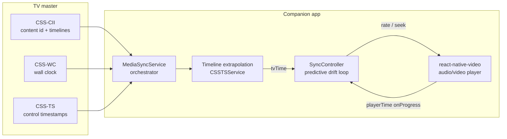
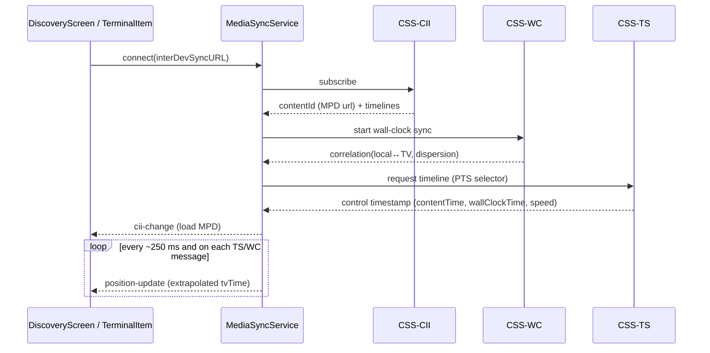
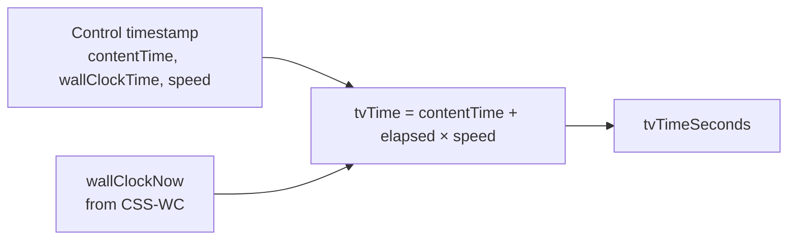
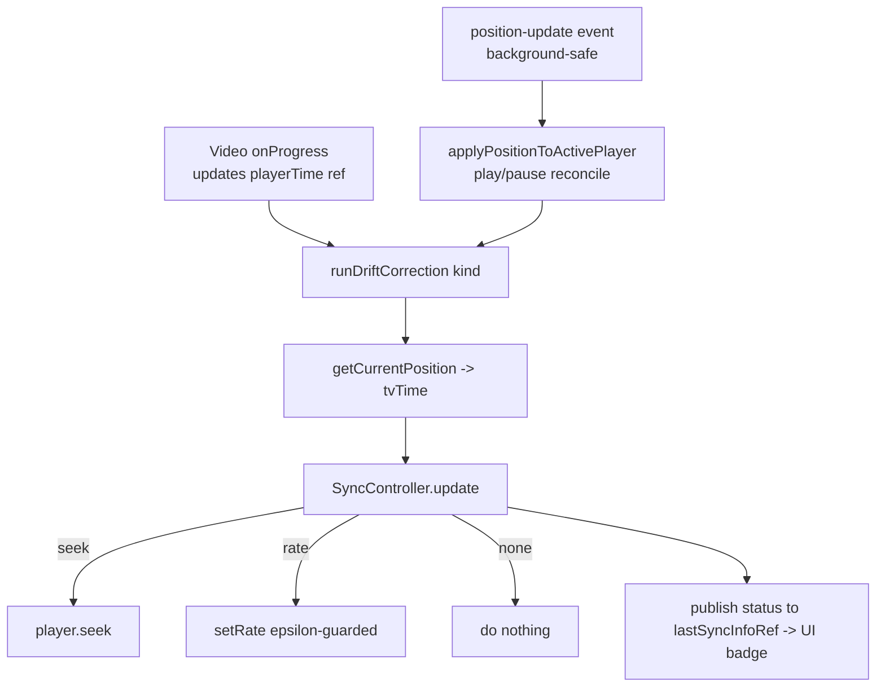
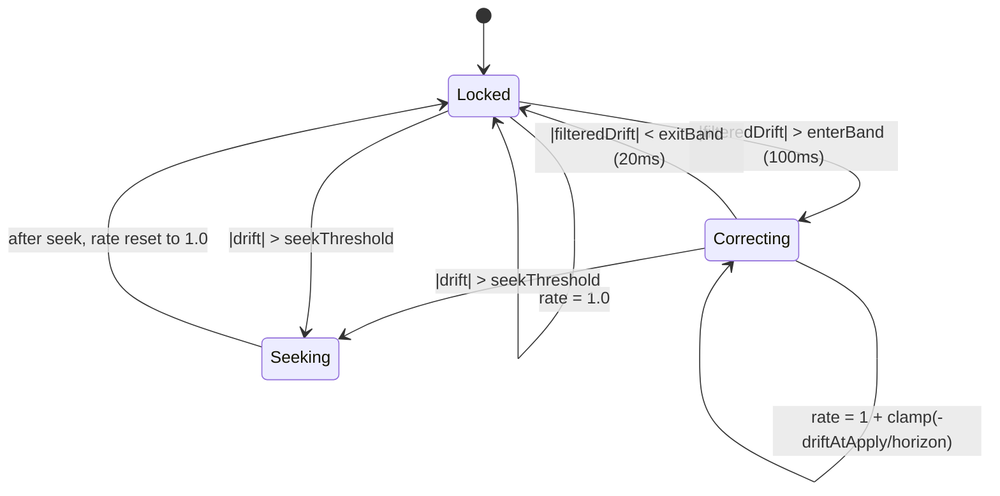

# Media Synchronisation — How It Works

This document explains, end to end, how the companion app keeps the phone's
audio/video **in sync with the TV** using DVB‑CSS over HbbTV, and how the
**predictive drift controller** keeps playback locked without hunting.

It is written for engineers touching the sync path. It mixes high‑level
diagrams with the exact mechanics and the tuning knobs.

---

## 1. The big picture

The TV is the **master clock**. The phone is a **slave** that continuously
measures how far its own playback is from the TV's timeline and nudges its
playback speed to stay aligned.

There are **two independent clocks** involved, and the whole system is a
**comparison** between them:

1. **The TV timeline (target)** — where the TV *is* in the content, expressed in
   media time. The TV does **not** stream us its position continuously; it sends
   an occasional *control timestamp*, and we **extrapolate** the position locally
   between updates using a synchronised wall clock.
2. **The player position (actual)** — where our local player is, reported by
   `react-native-video` via `onProgress`.

```
drift = playerPosition − tvTimelinePosition
```

- `drift > 0` → the phone is **ahead** → slow down (rate < 1.0)
- `drift < 0` → the phone is **behind** → speed up (rate > 1.0)
- `|drift|` huge → **seek** instead of nudging

We never "jump to the received position"; we steer playback speed so the two
clocks converge, and only hard‑seek when the gap is too large to close smoothly.



---

## 2. DVB‑CSS building blocks

DVB‑CSS (companion screen sync) is delivered over an HbbTV App2App WebSocket +
a UDP wall‑clock channel. Three protocols matter:

| Protocol | Service | What it provides | Cadence |
|----------|---------|------------------|---------|
| **CSS‑CII** | `CSSCIIService` | The current `contentId` (the DASH MPD URL or a companion web URL) and the available timelines. | On change |
| **CSS‑WC** | `CSSWCServiceUDP` (Android) / `CSSWCService` | A correlation between the **local clock** and the **TV wall clock** (nanoseconds), plus an uncertainty (*dispersion*). | ~1 s + heartbeat pokes |
| **CSS‑TS** | `CSSTSService` | *Control timestamps* `(contentTime, wallClockTime, speed)` that anchor the media timeline to the wall clock. | Every few seconds / on change |

`MediaSyncService` is the **orchestrator**: it connects all three, emits a
unified `position-update`, and exposes `getCurrentPosition()`.



---

## 3. The two clocks in detail

### 3.1 Wall clock (CSS‑WC)

The wall clock keeps a **correlation** point: "at local time `L0`, the TV wall
clock was `W0`". From that it extrapolates the TV wall clock at any instant:

```
wallClockNow = W0 + (localNow − L0) × speed        // nanoseconds
```

It re‑syncs about once per second (and on heartbeat "pokes" in the background)
and tracks a **dispersion** (uncertainty from round‑trip time). Each re‑sync can
shift the correlation slightly, which introduces a small **step** into
`wallClockNow` — a source of measurement noise (see §6).

File: [`src/services/CSSWCServiceUDP.js`](../src/services/CSSWCServiceUDP.js) —
`now()`, `setCorrelation()`.

### 3.2 Timeline extrapolation (CSS‑TS)

The TV sends a *control timestamp* that pins a media position to a wall‑clock
instant. Between timestamps we **extrapolate** the media position locally:

```
elapsedNanos = wallClockNow − controlTimestamp.wallClockTime
ticksElapsed = (elapsedNanos / 1e9) × tickRate × speed
tvPositionTicks = controlTimestamp.contentTime + ticksElapsed
tvTimeSeconds  = tvPositionTicks / tickRate            // tickRate = 90000 (PTS)
```

If `speed === 0` (paused), the position is frozen at `contentTime`.

File: [`src/services/CSSTSService.js`](../src/services/CSSTSService.js) —
`getCurrentPosition()`, `getCurrentPositionSeconds()`.



### 3.3 What `getCurrentPosition()` returns

`MediaSyncService.getCurrentPosition()` bundles everything the corrector and the
UI need:

| Field | Meaning |
|-------|---------|
| `positionSeconds` | Extrapolated TV timeline position (PTS) in seconds. **Target for VOD.** |
| `positionMillis` | Same, in ms. |
| `isPlaying` | `speed > 0`. |
| `speed` | Timeline speed multiplier (usually 1). |
| `isLive` | Live/DVR stream vs VOD. |
| `exoPlayerPositionSeconds` | Live only: TV position mapped into ExoPlayer's DVR window (`AST + tvPosition`). **Target for live.** |
| `formattedTime` | Human‑readable HH:MM:SS. |

---

## 4. The drift correction loop

### 4.1 Where it runs

Correction is driven from **two paths**, funnelled through one function
[`runDriftCorrection(kind)`](../src/components/TerminalItem.js):

- **Primary (foreground):** the player's `onProgress` callback. It updates the
  fresh player time, then re‑extrapolates `tvTime` on demand via
  `getCurrentPosition()` so **measurement and target are sampled at the same
  instant**.
- **Fallback (background):** the `position-update` event. When Android freezes JS
  timers in the background, incoming CSS‑TS WebSocket messages still wake JS, so
  the correction keeps running.

A short `SYNC_MIN_CORRECTION_INTERVAL_MS` (80 ms) throttle **de‑duplicates**
overlapping calls from the two paths.



### 4.2 The controller: predictive, filtered, hysteresis

The core logic is a **pure, unit‑tested state machine**:
[`src/utils/SyncController.js`](../src/utils/SyncController.js). Each call to
`update({ playerTime, tvTime, seekThresholdS })` does:

**1. Seek tier.** If `|drift| > seekThreshold` (2 s VOD, 5 s live) → return a
`seek` action, reset the filter, rate back to 1.0. The seek target is
**lead‑compensated** (`+ SYNC_SEEK_LEAD_S`) so the player lands where the TV
*will* be after the seek+rebuffer, and the seek is marked **in‑flight**:
corrections are suppressed until the player's `onSeek` confirms completion (or a
`SYNC_SEEK_COOLDOWN_MS` fallback elapses). Without this guard the corrector would
re‑seek every cycle to a moving target while DASH buffers — the classic
"seeking in many slow steps".

**2. EMA drift filter.** Low‑pass the raw drift to reject wall‑clock/onProgress
jitter:

```
filteredDrift = α × drift + (1 − α) × filteredDrift        // α = 0.25
```

**3. Hysteresis (lock band).** Prevents chattering around the target:

- **Locked** → start correcting only when `|filteredDrift| > enterBand` (100 ms).
- **Correcting** → return to lock (rate 1.0) when `|filteredDrift| < exitBand` (20 ms).

**4. Predictive rate nulling with lead compensation.** This is what stops the
overshoot / "reach sync then sail past it" behaviour. Instead of reacting to the
*measured* drift, we predict the drift at the moment the new rate actually takes
effect (after the loop dead‑time), and null it over a horizon:

```
driftAtApply = filteredDrift + (currentRate − 1) × deadTime   // lead term
rateDelta    = clamp(−driftAtApply / horizon, ±maxRateDelta)
newRate      = 1 + rateDelta
```

Because the lead term crosses zero **before** the real drift does, the
controller eases back toward 1.0 early — no overshoot, prompt return to x1.

**5. Epsilon guard.** Only emit a new rate if it changed by more than
`rateEps` (avoids React state churn).



### 4.3 Applying the rate

`react-native-video` takes `rate` as a prop, so a rate change flows through React
state (`setAudioRate` / `setVideoRate`) → re‑render → native player. The epsilon
guard and the wide lock band keep these updates rare, so playback stays glued at
`rate = 1.0` almost all the time.

---

## 5. Configuration reference

All tunables live in
[`src/utils/config.js`](../src/utils/config.js) under `MEDIA_SYNC`. Current
defaults:

| Key | Value | Purpose |
|-----|-------|---------|
| `PROGRESS_UPDATE_INTERVAL_MS` | `250` | Player `onProgress` cadence. Coarse enough that ExoPlayer's position settles between samples (avoids uneven deltas). |
| `POSITION_UPDATE_INTERVAL_MS` | `250` | `position-update` emit cadence (UI + background fallback). |
| `SYNC_MIN_CORRECTION_INTERVAL_MS` | `80` | De‑dup throttle between onProgress and position-update paths. |
| `SYNC_EMA_ALPHA` | `0.25` | Drift low‑pass weight. Lower = smoother, more noise rejection. |
| `SYNC_ENTER_BAND_S` | `0.10` | Engage correction above this filtered drift. Set well above real noise (~±20 ms) so noise never engages. |
| `SYNC_EXIT_BAND_S` | `0.02` | Return to rate 1.0 below this filtered drift. |
| `SYNC_HORIZON_S` | `3.0` | Time budget to null the predicted drift. Larger = gentler. |
| `SYNC_DEAD_TIME_S` | `0.35` | Loop dead‑time compensated by the lead term. |
| `SYNC_MAX_RATE_DELTA` | `0.05` | Max deviation from 1.0 (clamp to [0.95, 1.05]). |
| `SYNC_RATE_EPS` | `0.002` | Ignore rate changes smaller than this. |
| `SYNC_SEEK_COOLDOWN_MS` | `1500` | After a hard seek, suppress corrections until `onSeek` fires or this elapses (prevents re‑seek storms during buffering). |
| `SYNC_SEEK_LEAD_S` | `0.4` | Lead added to the seek target to compensate seek+rebuffer latency. |
| `DEBUG_SYNC` | `true`* | Console log of the control loop. **Set `false` for production.** |
| `TICK_RATE` | `90000` | PTS tick rate (90 kHz). |
| `TIMELINE_SELECTOR` | `urn:dvb:css:timeline:pts` | DVB‑CSS timeline selector. |

\* Diagnostic flag; disable when done tuning.

---

## 6. Measurement noise (important!)

The **real** drift is typically ±5–20 ms (sub‑frame) with `rate` pinned at 1.0.
But the *measured* drift shows periodic spikes of ~‑80/‑100 ms every 1–2 s. These
are **measurement artefacts, not real desync**:

- **onProgress quantisation:** ExoPlayer reports `currentTime` in coarse steps, so
  one reading comes short and the next "catches up" (e.g. +207 ms then +455 ms
  instead of two +331 ms steps).
- **Wall‑clock re‑correlation steps:** each CSS‑WC re‑sync nudges `wallClockNow`,
  stepping `tvTime` slightly.

The controller **absorbs** this via the EMA filter + the 100 ms engage band, so
noise never triggers a rate change. This is why the audio can sound perfectly
stable even while raw drift numbers look jumpy.

---

## 7. The on‑screen status badge

The UI badge (`sync` / `adjusting` / `seeking` / `waiting`) reflects the
**controller's real decision**, not a separate raw‑drift heuristic. On each
correction, `runDriftCorrection` publishes to `lastSyncInfoRef`:

- `status` — `locked` (rate 1.0), `adjusting` (controller in *correcting* mode),
  `seeking`, else `waiting` if no correction in the last 1 s.
- `driftMs` — the **filtered** drift (smoothed), so the number is stable.
- `rate` — the applied playback rate.

[`getPlayerSyncStatus()`](../src/components/TerminalItem.js) simply reads this,
so the badge shows a steady `sync` and only flips to `adjusting` when the rate
actually changes.

---

## 8. Background operation

Sync must survive the app being backgrounded:

- **Android:** a foreground service ([`modules/foreground-sync`](../modules/foreground-sync))
  keeps the JS thread, sockets and audio alive. A native **heartbeat** pokes the
  wall clock so CSS‑WC keeps measuring even though `setInterval` is frozen.
  Wall‑clock UDP uses [`modules/udp-wall-clock`](../modules/udp-wall-clock).
- **iOS:** relies on `UIBackgroundModes: ['audio']` while audio plays; multicast
  uses [`modules/udp-multicast`](../modules/udp-multicast).

Because incoming CSS‑TS WebSocket messages wake JS in the background, the
`position-update` → `runDriftCorrection` fallback keeps correcting even when
foreground timers are frozen.

---

## 9. VOD vs Live

| Aspect | VOD | Live / DVR |
|--------|-----|-----------|
| Target time | `positionSeconds` (PTS) | `exoPlayerPositionSeconds` (`AST + tvPosition`) |
| Player time | `onProgress.currentTime` | `onProgress.currentPlaybackTime` |
| Seek threshold | 2 s | 5 s |
| Seek target | `tvTime` | `playerCurrentTime − drift` |

The controller logic is identical; only the target/seek mapping differs. Current
tuning has been validated for **VOD on Android**; live remains functional but is
not deeply retuned.

---

## 10. Key files

| File | Role |
|------|------|
| [`src/services/MediaSyncService.js`](../src/services/MediaSyncService.js) | Orchestrator; emits `position-update`; `getCurrentPosition()`. |
| [`src/services/CSSCIIService.js`](../src/services/CSSCIIService.js) | Content id + timelines. |
| [`src/services/CSSWCServiceUDP.js`](../src/services/CSSWCServiceUDP.js) | Wall‑clock correlation (Android UDP). |
| [`src/services/CSSTSService.js`](../src/services/CSSTSService.js) | Timeline extrapolation from control timestamps. |
| [`src/utils/SyncController.js`](../src/utils/SyncController.js) | Predictive drift controller (pure, tested). |
| [`src/utils/__tests__/SyncController.test.js`](../src/utils/__tests__/SyncController.test.js) | Controller unit tests. |
| [`src/components/TerminalItem.js`](../src/components/TerminalItem.js) | Player wiring, `runDriftCorrection`, UI badge. |
| [`src/utils/config.js`](../src/utils/config.js) | All tunables (`MEDIA_SYNC`). |

---

## 11. Tuning / troubleshooting cheatsheet

- **Audio wobble / pitch changes:** rate is changing too often. Raise
  `SYNC_ENTER_BAND_S`, lower `SYNC_EMA_ALPHA`, or lower `SYNC_MAX_RATE_DELTA`.
- **Overshoot ("reaches sync then passes it"):** raise `SYNC_HORIZON_S` (gentler)
  and/or set `SYNC_DEAD_TIME_S` closer to the real measured latency.
- **Badge flickers but audio is fine:** expected if reading raw drift — the badge
  now uses filtered drift + controller mode, so it should be steady.
- **Slow to catch a real large jump:** that's the seek tier; check
  `seekThreshold` (2 s VOD / 5 s live).
- **Diagnostics:** set `DEBUG_SYNC: true` and read the `🎯 sync[...]` lines
  (`drift`, `filt`, `tv`, `player`, `rate`, `act`). Turn off for production.
```
